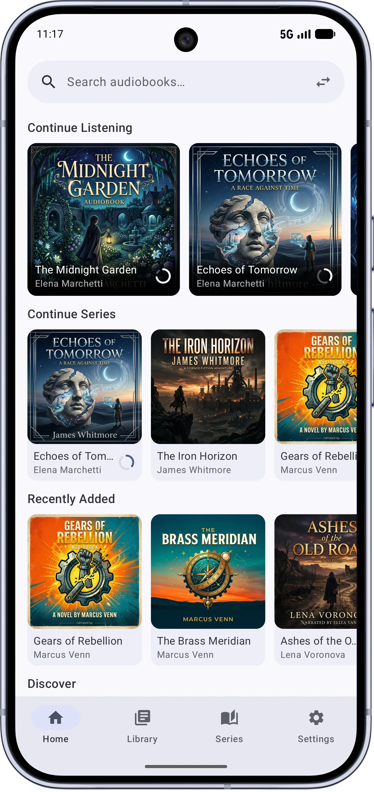
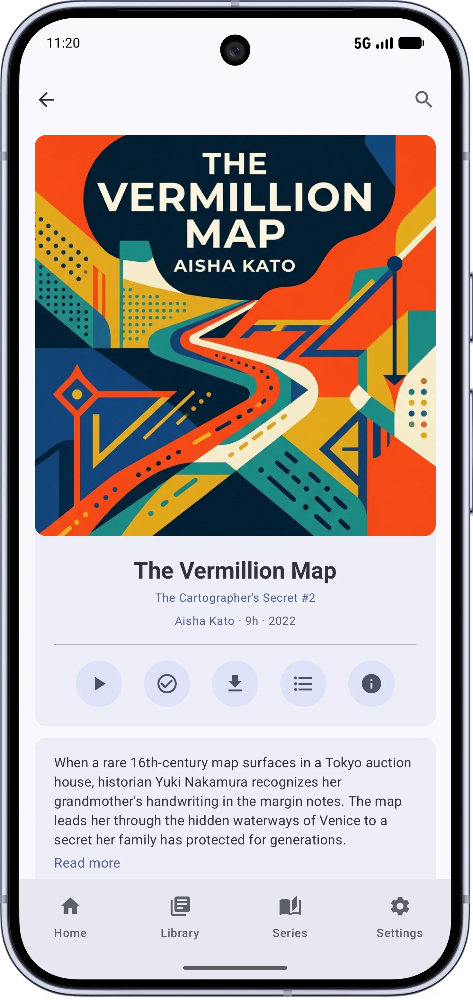
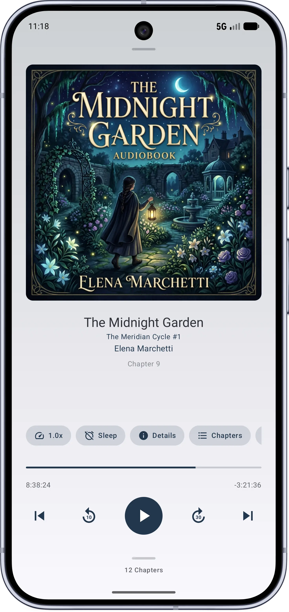
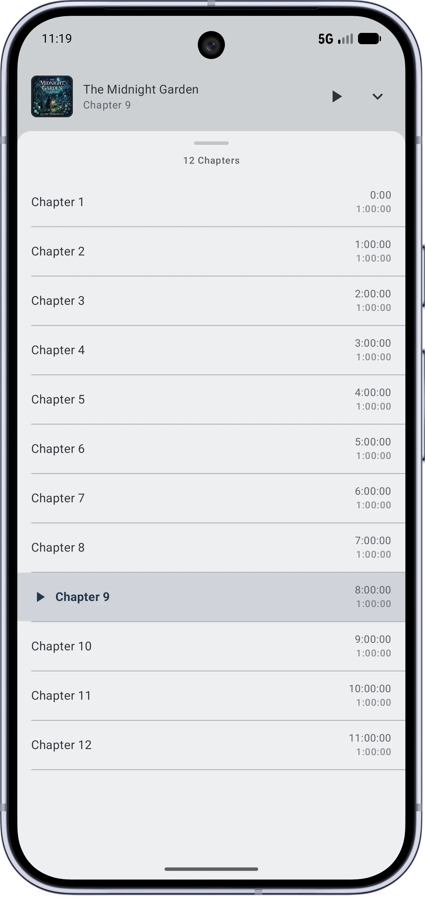
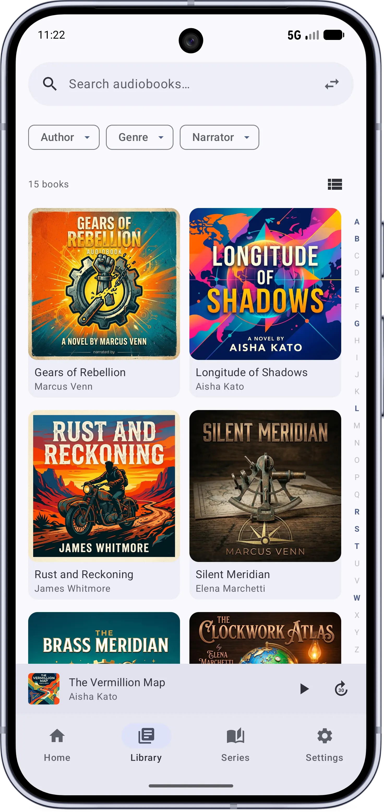
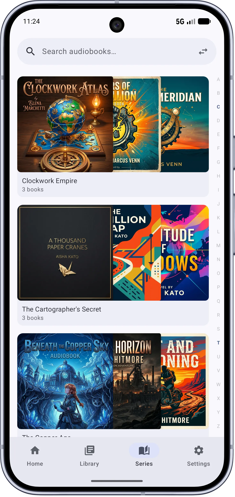
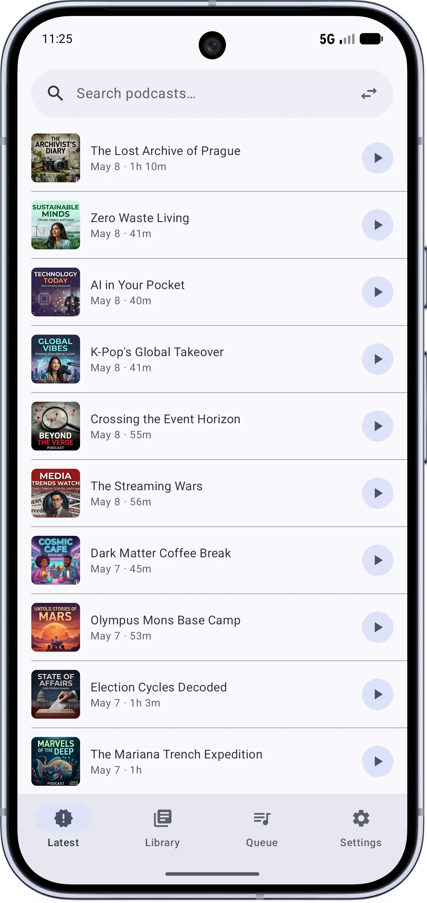
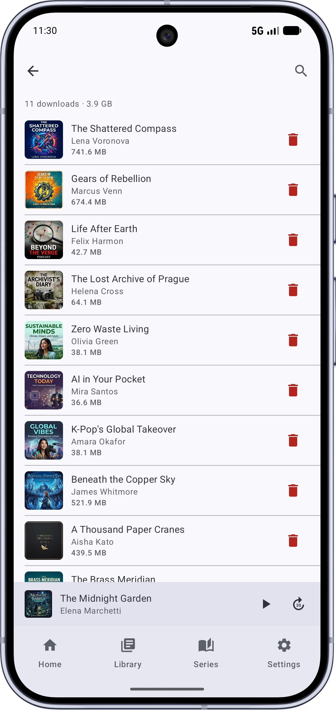

<p align="center">
  
</p>

# Unshelved

A modern Android client for [Audiobookshelf](https://www.audiobookshelf.org/).

## Features

- Stream or download audiobooks from your Audiobookshelf server
- Background playback with media controls and sleep timer
- Offline listening with automatic progress sync
- Chapter navigation and playback speed control
- Series browsing and library organization
- Search across books, authors, and narrators
- Material You design with dynamic theming
- Android Auto support
- Casting support

## Screenshots

<p align="center">
  
  
  
  
</p>
<p align="center">
  
  
  
  
</p>

## Requirements

- Android 8.0 (API 26) or higher
- An [Audiobookshelf](https://www.audiobookshelf.org/) server (v2.x)

## Building

```bash
./gradlew assembleDebug
./gradlew installDebug
```

## Tech Stack

- Kotlin, Jetpack Compose, Material 3
- Media3 / ExoPlayer for playback
- Hilt for dependency injection
- Retrofit for networking
- Room for local storage
- Proto DataStore for preferences

## Mock Server

A mock Audiobookshelf server is included for development and screenshots. See [dev-resources/mockserver/README.md](dev-resources/mockserver/README.md).

## Privacy

Unshelved does not collect any user data. See the full [Privacy Policy](docs/privacy-policy.md).

## License

This project is licensed under the [GNU General Public License v3.0](LICENSE).
